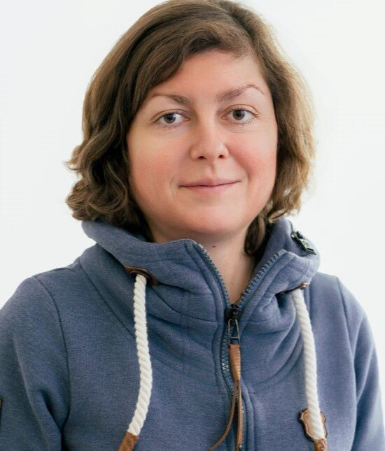

:::{.section_bulletin}
# PROPOSAL FOR A NEW ISBA SECTION {#sec-proposal}
[Nadja Klein](mailto:nadja.klein@kit.edu){style="color:white; text-align: center;"}
:::

::: {.column-margin}
{style="float:center;vertical-align:middle;
margin:10px 20px;border-radius: 10px;max-width: 100%;"}
:::

 

:::{.justify}
We are excited to share that we are proposing a new ISBA Section on **Bayesian Structural Learning (BSL)**! We are currently collecting signatures from those would like to support the creation of this section. If you are interested in learning more or would like to add your support, please reach out at [this email address](mailto:kleinlab@scc.kit.edu) with your full name, affiliation, email address, and specifying whether you are an ISBA member. The initial officers will be David Dunson, Nadja Klein, Rodney Sparapani, and Deborah Sulem.

Bayesian Structural Learning (BSL) refers to methods that uncover the hidden structure of complex stochastic systems while explicitly quantifying uncertainty. This is essential in modern data science: it allows us to reason about competing structural explanations, assess their implications, and make robust decisions under uncertainty. 

BSL brings together: 

- The core statistical activity of modeling and understanding structural aspects of high-dimensional and complex data  
- Bayesian principles that enable coherent uncertainty quantification, principled model comparison, and transparent integration of prior knowledge.

We believe these ideas are currently spread across multiple ISBA Sections, but not explicitly represented by any of them — motivating the need for a dedicated BSL Section. The proposed section aims to provide an inclusive home for researchers working on methods for high-dimensional or structurally complex data, including flexible regression via latent variable and hierarchical models, dependence modeling (e.g., graphical models, copulas, networks), causal inference, spatio-temporal analysis, factor models, and clustering.

Thank you very much for your support!
:::