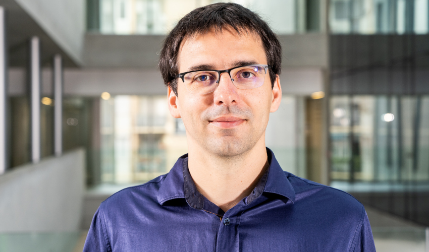

:::{.section_bulletin}
# FROM THE PRIZE COMMITTEE {#sec-prize}
[Botond Szabó](mailto:botond.szabo@unibocconi.it){style="color:white; text-align: center;"}
:::

::: {.column-margin}
{style="float:center;vertical-align:middle;
margin:10px 20px;border-radius: 10px;max-width: 115%;"}
:::

 

:::{.justify}
The ISBA Prize Committee and sub-committees have continued their important work within ISBA.
The next ISBA Awards Ceremony will take place during our ISBA World Meeting held
in Nagoya, Japan, from June 28 to July 3, 2026. In this issue, we announce the finalists in both categories.

### Savage 2025 Award Finalists

In the Category of **Applied Methodology**, the four finalists (in alphabetical order of their last name)
are

- Brandon Carter (University of Texas at Austin) for the thesis:  
  “Bayesian Spatial Models for Discrete Data:
  Methodological Advances with Applications in Urban Sociology”.  
  Supervisor: Catherine A. Calder.

- Jorge Castillo-Mateo (University of Zaragoza) for the thesis:  
  “Stochastic models for the spatio-temporal
  analysis of extremes: Applications to the analysis of climate change”.  
  Supervisors: Ana C. Cebri'an Guajardo and
  Alan E. Gelfand.

- Changwoo Lee (Texas A&M University) for the thesis:  
  “Probabilistic clustering methods for complex data and related topics”.  
  Supervisor: Huiyan Sang.

- Michael Schwob (University of Texas at Austin) for the thesis:  
  “Bayesian Hierarchical Models for Dependent Ecological Data”.  
  Supervisor: Mevin B. Hooten.

In the Category of **Theory and Methods**, the four finalists (in alphabetical order of their last name) are:

- Filippo Ascolani (Bocconi University) for the thesis:  
  “Hierarchical structures in Bayesian Statistics”.  
  Supervisors: Igor Prünster and Antonio Lijoi.

- Hyunwoong Chang (University of Texas at Dallas) for the thesis:  
  “Convergence analysis of Markov chain Monte Carlo methods for model selection problems”.  
  Supervisors: Quan Zhou and Suojin Wang.

- Samhita Pal (North Carolina State University) for the thesis:  
  “Bayesian Inference in High-dimensional regression Models using Sparse Projection-Posterior”.  
  Supervisor: Subhashis Ghoshal.

- Yuren Zhou (Duke University):  
  “Bayesian Deep Discrete Latent Structures”.  
  Supervisor: David B. Dunson.

The Savage Award 2025 sub-committees comprised of  
Veera Baladandayuthapani (University of Michigan), Noirrit Kiran Chandra (University of Texas - Dallas), Daniele Durante (Bocconi University),
Claire Gormley (University College Dublin), Jeff Miller (Harvard University, chair), Yang Ni (Texas A&M University), Yasuhiro Omori (University of Tokyo), Garritt Page (Brigham Young University), and Yixin Wang (University of Michigan) for the
category of Applied Methodology, and Federico Camerlenghi (University of Milano-Bicocca), Fabrizio Leisen (King's College London), Feng Liang (University of Illinois Urbana-Champaign), David Nott (National University of Singapore), Fernando Quintana (Pontificia Universidad Católica de Chile), and
Athanasios Kottas (University of California, chair) for the category of Theory and
Methods. They were all very impressed with the high quality of submissions this year and congratulate all applicants on their fine contributions to Bayesian statistics.

The Savage Award finalists’ presentations are scheduled for June 30 and July 1, and the award ceremony will take place during the banquet on Friday, July 3. You are all warmly invited to attend, and we hope to see many of you there!
:::