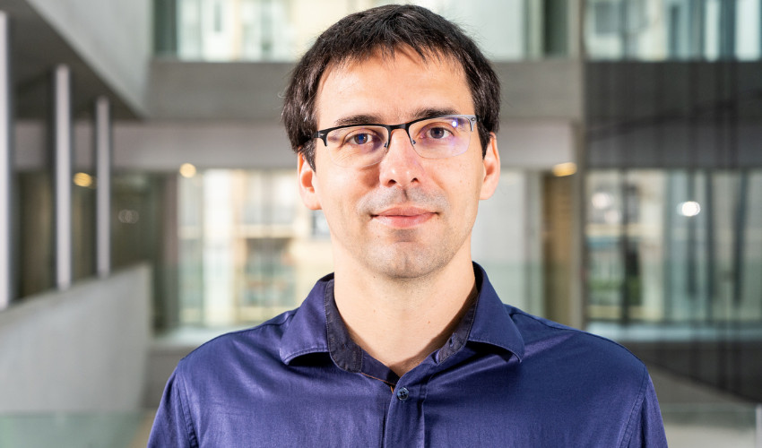

:::{.section_bulletin}
# FROM THE PRIZE COMMITTEE {#sec-prize}
[Natalia Bochkina and Botond Szabó (co-chairs)](mailto: prize-committee@bayesian.org){style="color:white; text-align: center;"}

:::

::: {.column-margin}
{style="float:center;vertical-align:middle;
margin:10px 20px;border-radius: 10px;max-width: 115%;"}
{style="float:center;vertical-align:middle;
margin:10px 20px;border-radius: 10px;max-width: 115%;"}
:::

 

:::{.justify}
This year, the ISBA Awards Ceremony was held in Nagoya, Japan during 2026 ISBA World Meeting from 28 June to 3 July 2026. The ISBA Awards were announced at the ISBA banquet on July 3rd. The event was attended by hundreds of colleagues, who celebrated the different achievements of young and not so young statisticians in our Bayesian community.

On behalf of ISBA prize committee, we want to acknowledge all the intense work for our award subcommittee members. Without their hard work and dedication of their personal time, our committee work would have not been completed so smoothly. Thus, we want to thank them again for their great contribution to our community.

Regarding the awards bestowed during the Award Ceremony, we would like to congratulate the following awardees:

### 2025 Savage Award in the Category of Theory and Methods

**Winner:** Filippo Ascolani for his thesis entitled "Hierarchical Structures in Bayesian Statistics" (Supervisors: Antonio Lijoi and Igor Prünster).

**Honorable Mention:** Samhita Pal for her thesis entitled "Bayesian inference in high-dimensional regression models using sparse projection posterior" (Supervisor: Subhasis Ghoshal).

**Finalists:** Hyunwoong Chang for his thesis "Convergence analysis of Markov chain Monte Carlo methods for model selection problems" (Supervisors: Quan Zhou and Suojin Wang), and Yuren Zhou for his thesis "Bayesian deep discrete latent structures" (Supervisor: David Dunson).

On behalf of the ISBA Prize Committee, we are very grateful to Athanasios Kottas, who chaired the 2025 Savage Award sub-committee for Theory and Methods, and all colleagues who were a part of it: Federico Camerlenghi, Fabrizio Leisen, Feng Liang, David Nott, and Fernando Quintana.

### 2025 Savage Award in the Category of Applied Methodology

**Winner:** Jorge Castillo-Mateo for his thesis entitled "Stochastic Models for the Spatio-Temporal Analysis of Extremes, Applications to the Analysis of Climate Change" (Supervisor: Ana C. Cebrián Guajardo and Alan E. Gelfand).

**Honorable Mention:** Michael Schwob for his thesis entitled "Bayesian Hierarchical Models for Dependent Ecological Data" (Supervisor: Mevin B. Hooten).

**Finalists:** Brandon Carter for his thesis "Bayesian Spatial Models for Discrete Data: Methodological Advances with Applications in Urban Sociology" (Supervisor: Catherine A. Calder) and Changwoo Lee for his thesis "Probabilistic Clustering Methods for Complex Data and Related Topics" (Supervisor: Huiyan Sang).

On behalf of the ISBA Prize Committee, we are very grateful to Jeff Miller, who chaired the 2025 Savage Award sub-committee for Applied Methodology, and all colleagues who were a part of it: Veera Baladandayuthapani, Noirrit Kiran Chandra, Daniele Durante, Claire Gormley, Yang Ni, Yasuhiro Omori, Garritt Page, and Yixin Wang.

### 2025 Mitchell Prize

**Winner:** Michael Pearce, and Elena A. Erosheva for their paper "Modeling Preferences: A Bayesian Mixture of Finite Mixtures for Rankings and Ratings," published in Journal of the American Statistical Association (Theory and Methods) 120 (551): 1621–1632, 2025.

**Honorable Mentions:** Moumita Chakraborty, Veerabhadran Baladandayuthapani, Anindya Bhadra, Min Jin Ha (Honorable Mention) for their paper "Bayesian Robust Learning in Chain Graph Models for Integrative Pharmacogenomics," published in Annals of Applied Statistics, 18(3), 2145–2172, 2024. Wei Jin, Yang Ni, Jane O'Halloran, Amanda B. Spence, Leah H. Rubin, and Yanxun Xu (Honorable Mention) for their paper, "A Bayesian Decision Framework for Optimizing Sequential Combination Antiretroviral Therapy in People with HIV," published in Biometrics 79 (4): 2196–2208, 2023.

On behalf of the ISBA Prize Committee, we are very grateful to Sara Wade, who chaired the 2025 Mitchell Prize sub-committee, and all colleagues who were a part of it: Mike Daniels, David Dunson, Jim Smith, Mike So, and Valeria Vitelli.

### 2024 Lindley Prize

**Winner:** Jim Griffin for his paper "Expressing and Visualizing Model Uncertainty in Bayesian Variable Selection Using Cartesian Credible Sets", published in Bayesian Analysis 20(4), 1371–1397, 2025.

**Honorable Mention:** Changwoo J. Lee, Alessandro Zito, Huiyan Sang, David B. Dunson for their paper entitled "Logistic-Beta Processes for Dependent Random Probabilities with Beta Marginals", published in Bayesian Analysis 20(4): 1345-1369, 2025.

On behalf of the ISBA Prize Committee, we are very grateful to Igor Prunster, who chaired the 2024 Lindley Prize sub-committee and all colleagues who were a part of it: David Frazier, Ryan Giordano, Jonathan Huggins, Nadja Klein, Li Ma, Minerva Mukhopadhyay, Ilsang Ohn, and Yixin Wang.

### 2025 DeGroot Prize

**Winner:** Raquel Prado, Marco A. R. Ferreira, and Mike West for their book "Time Series Modeling, Computation, and Inference, Second Edition"

On behalf of the ISBA Prize Committee, we are very grateful to Botond Szabo, who chaired the 2025 DeGroot Prize sub-committee and all colleagues who were part of it: Marina Vannucci, Hedibert Lopes, Richard Gill, Toshiaki Watanabe, and Dipak Dey.

### 2026 Zellner Medal

**Winner:** Kerrie Mengersen for her outstanding contributions to Bayesian computation, methodology, and applied modeling, and for her transformative service and leadership within the International Society for Bayesian Analysis and the Australasian statistics community, making a lasting impact on both the science and the culture of Bayesian statistics.

**Winner:** Sylvia Richardson for her numerous and deep contributions to Bayesian statistics and biostatistics throughout her career, for her substantial service to ISBA including her presidency of ISBA in 2005 that saw the launch of Bayesian Analysis, and for her leadership of the RSS Covid‐19 Task Force, which provided rational and crucial support during the pandemic.
:::