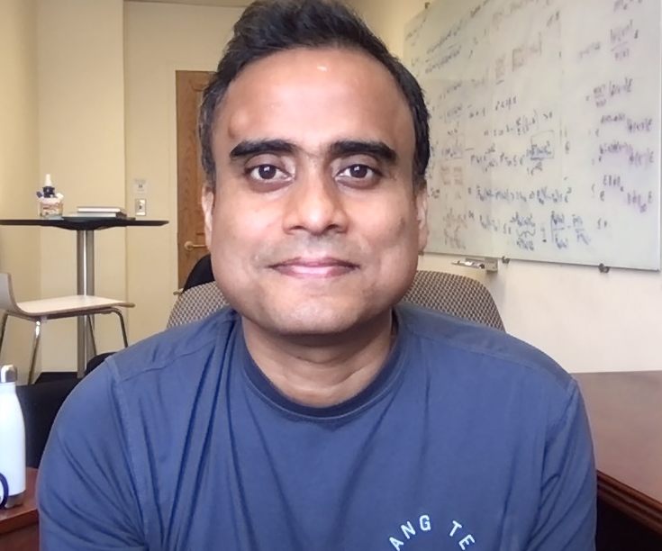
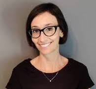

::: {.section_bulletin}
# AWARDS {#sec-awards}
[Surya Tokdar and Lucia Paci](mailto:prize-committee@bayesian.org){style="color:white; text-align: center;"}
:::

::: {.column-margin}
{style="float:center;vertical-align:middle;
margin:10px 20px;border-radius: 10px;max-width: 100%;"}
{style="float:center;vertical-align:middle;
margin:10px 20px;border-radius: 10px;max-width: 150%;"}
:::
 

:::{.justify}
## Savage Applied Methodology 2024

**Awards Committee:**  
Veronica Berrocal (Chair; UC Irvine, USA);  
Roberta De Vito (Brown University, USA);  
Dani Gamerman (UFRJ, Brazil);  
Clara Grazian (University of Sydney, Australia);  
Andrew Holbrook (UCLA, USA);  
Juhee Lee (UC Santa Cruz, USA);  
Andrew Zammit-Mangion (University of Wollogong, Australia).  

**Honorable Mentions:**  

 **Nicholas Marco**, PhD at UCLA; *“Mixed Membership Models with Applications to Neuroimaging.”*  

 **Melodie Monod**, PhD at Imperial College London; *“Bayesian Models and Methods to Estimate Age-specific Infectious Disease Transmission Dynamics.”*  

**Winner:**  

 **Alessandro Zito**, PhD at Duke University; *“Ecological Modeling via Bayesian Nonparametric Species Sampling Priors.”*  

---

## Savage Theory and Methods 2024

**Awards Committee:**  
Marta Catalano (Luiss University);  
Peter Hoff (Duke University);  
Jaeyong Lee (Chair; Seoul National University);  
Kyungjae Lee (Sungkyunkwan University);  
Feng Liang (University of Illinois Urbana–Champaign);  
Depdeep Pati (University of Wisconsin);  
Yanxun Xu (Johns Hopkins University).  

**Honorable Mention:**  

 **Maria Fernanda Gil-Leyva**, PhD at National Autonomous University of Mexico; *“Stick-breaking Processes and Related Random Probability Measures.”*

**Winner:**  

 **Takuo Matsubara**, PhD at Newcastle University; *“Bridging the Gap Between Modeling and Computation in Bayesian Statistics.”*

---

## Mitchell Prize 2024

**Awards Committee:**  
Chris Drovandi (Queensland University of Technology, Australia);  
Didong Li (University of North Carolina, USA);  
Finn Lindgren (University of Edinburgh, UK);  
Brian Reich (Chair; North Carolina State University, USA);  
Toryn Schafer (Texas A&M University, USA).  

**Honorable Mentions:**

- Ethan M. Alt, Xiuya Chang, Xun Jiang, Qing Liu, May Mo, Hong Amy Xia, and Joseph G. Ibrahim (2024).  
  “LEAP: The Latent Exchangeability Prior for Borrowing Information from Historical Data.”  
  _Biometrics_, 80(3): 1–10.

- Georgia Papadogeorgou, Carolina Bello, Otso Ovaskainen, and David B. Dunson (2023).  
  “Covariate-Informed Latent Interaction Models: Addressing Geographic & Taxonomic Bias in Predicting Bird–Plant Interactions.”  
  _Journal of the American Statistical Association_, 118(544): 2250–2261.

**Winner:**  

- Clara Hoffmann and Nadja Klein (2023).  
“Marginally Calibrated Response Distributions for End-to-End Learning in Autonomous Driving.”  
_Annals of Applied Statistics_, 17(2): 1740–1763.

---

## Calls for nominations

#### New ISBA Fellows

Nominations are now being accepted for **new ISBA Fellows**. Nominees must be current ISBA members and should have been members for the last three consecutive years, at least.

The individual's contributions should have had a significant impact in promoting Bayesian ideas and methods in society, through scientific works and other activities, such as teaching, consulting or service. Submissions and supporting letters should not be made by current members of the Fellows Selection Committee to avoid conflicts of interest. Nominations may be made by any current ISBA member.

Please prepare nominations as a single PDF file following the convention `LASTNAME_FIRSTNAME.pdf` so the file name corresponds to the nominee, and then email them to [fellows@bayesian.org](mailto:fellows@bayesian.org).  
Nominations must be received on or before **February 1, 2026**. The new fellows will be announced at the 2026 ISBA World Meeting in Nagoya, Japan. Please contact Michele Guindani ([micheleguindani@gmail.com](mailto:micheleguindani@gmail.com)), ISBA President, with any questions. Questions will be relayed to the ISBA Fellows Committee.

#### ISBA Zellner Medal

Nominations are now being accepted for the **ISBA Zellner Medal**, which recognizes ISBA members who have rendered exceptional and distinguished service to ISBA over an extended period of time, and whose contributions have had an impact on the society beyond the time of his or her incumbency. Nominees must be current ISBA members and should have been members for the last three consecutive years, at least. They should have served ISBA in a range of leadership roles over an extended period of time.

Please prepare nominations as a single PDF file following the convention `LASTNAME_FIRSTNAME.pdf` so the file name corresponds to the nominee and then email them to [zellner-medal@bayesian.org](mailto:zellner-medal@bayesian.org). Nominations must be received on or before **January 1, 2026**. The Zellner Medal recipient(s) will be announced and celebrated at the 2026 ISBA World Meeting in Nagoya, Japan.

Please contact Alan Gelfand ([alan@duke.edu](mailto:alan@duke.edu)), Chair of the Zellner Medal Selection Committee, with any questions.

:::

