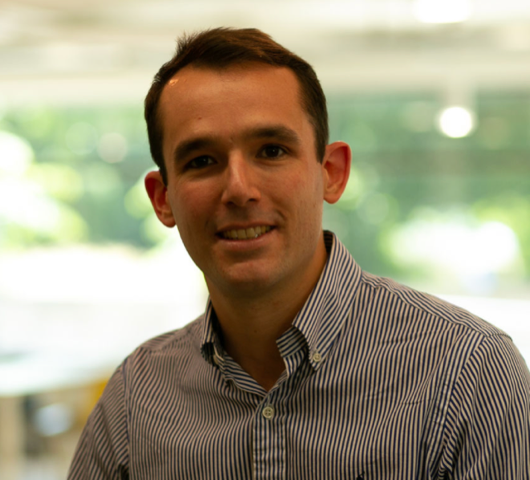

::: {.section_bulletin}
# JUNIOR ISBA {#sec-jisba}
[Matteo Giordano](mailto:jisba.section@gmail.com){style="color:white; text-align: center;"}
:::

::: {.column-margin}
{style="float:center;vertical-align:middle;
margin:10px 20px;border-radius: 10px;max-width: 100%;"}
:::

 

:::{.justify}
Dear ISBA community,  
On behalf of the j-ISBA Board, let me say that it was wonderful to meet so many of you at the social event we organized during the BNP in Los Angeles, where more than 100 of you attended!

Looking forward, we’re excited to share updates on upcoming events and opportunities that continue to unite our early-career researchers’ community, such as the upcoming BAYSM 2026, the next organized sessions, the peer mentoring scheme by j-ISBA, and the upcoming elections.

For any questions or suggestions, please feel free to reach out to the j-ISBA board via email at [this email address](mailto:jisba.section@gmail.com), or also on our new official [LinkedIn page](https://www.linkedin.com/company/j-isba-the-junior-section-of-the-international-society-for-bayesian-analysis/).

### Upcoming events

- The 2025 edition of the Blackwell-Rosenbluth Award is well underway. We look forward to announcing the winners soon!

- The next edition of BAYSM will be held on June 26 – 27, 2026, at Chiba University, Japan! This will be just before the ISBA World Meeting 2026. The planning for the event is in full swing, so stay tuned for more information!

- The ISBA Elections are coming, and we would greatly appreciate your vote! Please make sure to cast your ballot for the three opening positions on the j-ISBA board: Chair-Elect, Program Chair, and Secretary.

- Do not miss the next conference sessions organized by j-ISBA:

  - **IDWSDS 2025 - International Day of Women in Statistics and Data Science Conference**  
    Date and location: October 14, 2025, Online  
    This is a fully online and free event!  
    j-ISBA is sponsoring the session “Advances from Junior Bayesian Statisticians” with the following amazing speakers: Beatrice Franzolini (Bocconi University), Yunshan Duan (Johns Hopkins University), and Daria Bystrova (Pierre Louis Institute of Epidemiology and Public Health). Find more info at [this link](https://www.idwsds.org/).

  - **CFE-CMStatistics Computational and Methodological Statistics Conference**  
    Date and location: December 13-15, 2025, London  
    j-ISBA is sponsoring the session “j-ISBA session on new advances in Bayesian statistics” where you can hear about the interesting work of Myung Won Lee (University of Edinburgh), Harita Dellaporta (University College London), Luke Hardcastle (University College London) and Gerardo Duran-Martin (University of Oxford).

### Peer mentoring

The j-ISBA Peer Mentoring Scheme is an opportunity for you to be paired online with another young researcher in the field, providing a friendly and secure place to seek support and guidance.  
Peer mentors are j-ISBA members who have volunteered to join the program. Based on their experiences, they will be able to offer you advice on how to navigate the uncertainties and difficulties that may arise during your early years in research.

j-ISBA is currently seeking Peer Mentors for the academic year 2025-26. If you are interested in supporting our community of young Bayesian statisticians in this way, please get in touch by email with the j-ISBA board.
:::

 