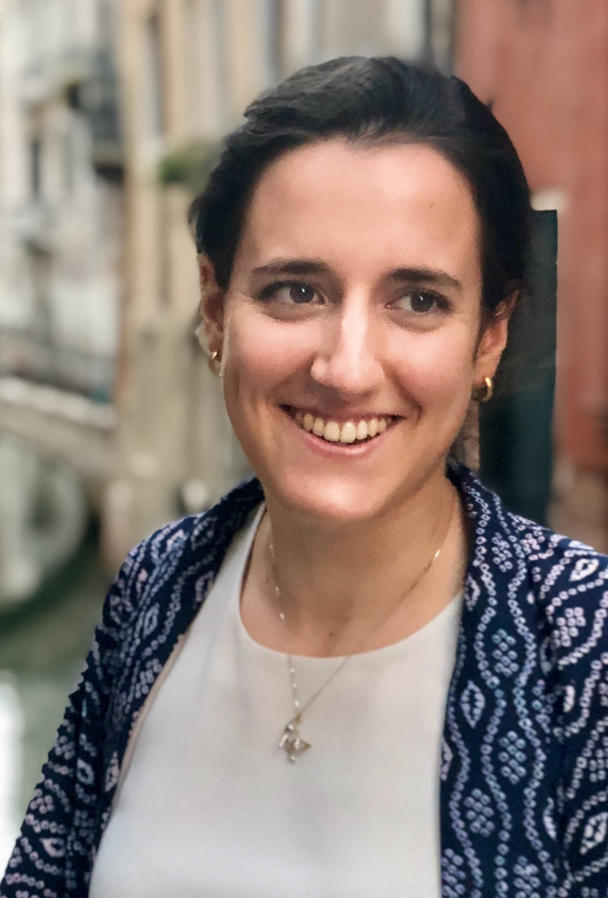

::: {.section_bulletin}
# JUNIOR ISBA {#sec-jisba}
[Francesca Panero](mailto:jisba.section@gmail.com){style="color:white; text-align: center;"}
:::

::: {.column-margin}
{style="float:center;vertical-align:middle;
margin:10px 20px;border-radius: 10px;max-width: 100%;"}
:::

 

:::{.justify}
Dear ISBA community,

welcome back to the j-ISBA news! Let us start with a refresher of the not-so-new news, but still relevant:

* [BAYSM 2026](https://baysm2026.github.io) is around the corner: we will see the many participants on June 26 and 27 in Chiba, Japan. We will gain research insights from the keynote speakers Kerrie Mengersen and Kengo Kamatani, 12 talks with discussion, and 52 posters. Prizes will be awarded to the best talks and posters, so be shiny!
* [The Blackwell-Rosenbluth Award](https://j-isba.github.io/blackwell-rosenbluth.html) applications are open until July 12. Remember to nominate your favorite junior Bayesian (who could be yourself!).

### j-ISBA mixer at ISBA

During ISBA, we will hold a j-ISBA event to spend some time all together, get to know nice people, and announce the next activities of j-ISBA. The j-ISBA mixer will happen on Wednesday at 8pm, after the poster session. One drink and some snacks are on us, and additional food and drinks can be purchased in the bar.

The event is limited by space constraints, and we will operate on a first-come, first-served basis. You will receive an email notification with the location address at the beginning of the ISBA week. To participate, please [fill in this form](https://docs.google.com/forms/d/e/1FAIpQLSekARMW_oYs0rS5iWmNuD-8dmzVzEqdqMFJl0uRAb0TJGrj4w/viewform?usp=dialog) before Sunday, June 28th.

### j-ISBA is looking for officers!

In the next ISBA elections, the j-ISBA board will need two new board members to fill the positions of Chair-Elect and Treasurer for the years 2027-2028. I can tell you firsthand that serving on the board is a really rewarding and exciting experience. Senior PhD students, postdocs, and early career researchers are encouraged to apply. Those interested in being nominated for the elections are invited to submit a CV and a motivation letter to [jisba.section@gmail.com](mailto:jisba.section@gmail.com). To be given full consideration, please limit your motivation letter to 2 pages and submit your materials by July 15, 2026.
:::