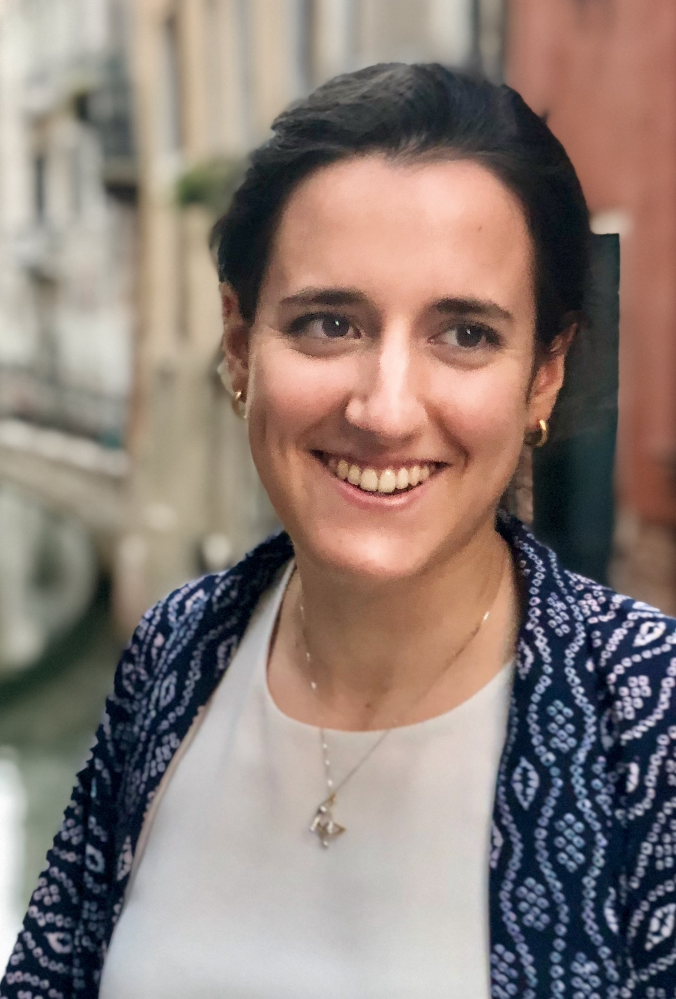

::: {.section_bulletin}
# JUNIOR ISBA {#sec-jisba}
[Francesca Panero](mailto:jisba.section@gmail.com){style="color:white; text-align: center;"}
:::

::: {.column-margin}
{style="float:center;vertical-align:middle;
margin:10px 20px;border-radius: 10px;max-width: 100%;"}
:::

 

:::{.justify}
## BAYSM 2027: dates announced!

We are pleased to confirm that the next edition of the j-ISBA conference BAYSM will be held on April 12–16, 2027. The conference will take place entirely online, with an extremely low registration fee for j-ISBA members, ensuring accessibility for early career researchers from all over the world. Abstract submissions will open in October: stay tuned for news.

## Organized sessions at conferences

We are organizing sessions at various conferences happening this fall, winter and spring:

- [International Day of Women in Statistics and Data Science (IDWSDS) 2026](https://www.idwsds.org), held online on October 6, 2026. The speakers will be Federica Zoe Ricci (Swarthmore College), Louise Alamichel (Université Clermont Auvergne), Martina Contisciani (Goethe University Frankfurt), and Jie Jian (University of Chicago).

- "*New developments in Bayesian statistics: a j-ISBA sponsored session*" at the [International Indian Statistical Association (IISA) 2026](https://www.intindstat.org/conference2026/index), December 26-30, Varanasi. The speakers will be Vaidehi Dixit (University of Nottingham), Arka Banerjee (Indian Institute of Science Bangalore), and Miheer Dewaskar (University of New Mexico). Chair: Beniamino Hadj-Amar (University of South Carolina).

- "*Contributions from junior Bayesians: a j-ISBA session*" at the [LACSC-TIES-EnviBayes-EnvrASA 2026](https://www.amestad.mx/lacsc-ties-envibayes-envrasa-2026), December 7-11, in Mexico City. The speakers will be Carlos Carrillo-Gallegos (Columbia University), Marco Gallegos (University of Toronto), and Dafne Zorzetto (Georgia State University).

- "*Advances in Bayesian Nonparametric and Latent Variable Modeling: Recent Contributions from j-ISBA Members*" at the [VIII Latin American Meeting on Bayesian Statistics (COBAL) and XVIII Brazilian Meeting of Bayesian Statistics (EBEB)](https://cobalebeb2027.softaliza.com.br/), to be held in Búzios, Rio de Janeiro, from March 1 to 5, 2027. The session will feature three talks on flexible Bayesian methods for complex data, presented by j-ISBA members from different parts of the world: Santiago Marin (Australian National University), Maria Fernanda Pintado (CUNEF Madrid), and Ingrid Johana Guevara Romero (Pontificia Universidad Católica de Chile).
:::