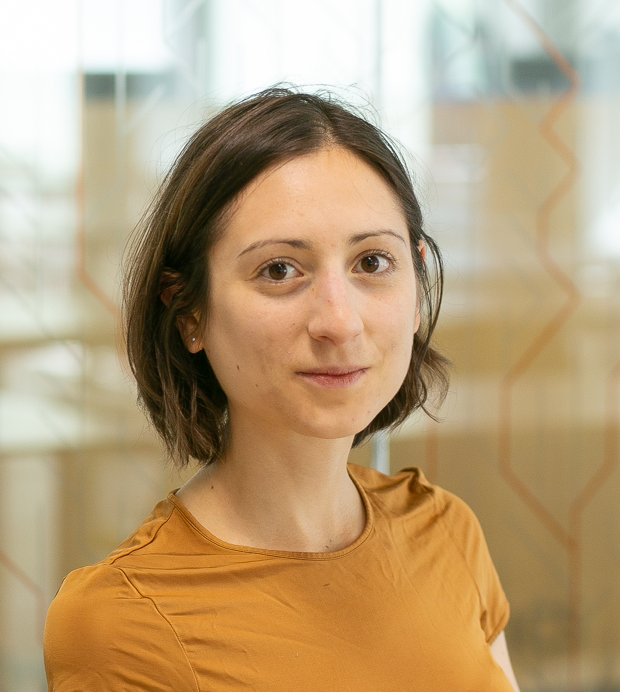

::: {.section_bulletin}
# NEWS FROM THE WORLD {#sec-news}
[Déborah Sulem](deborah.sulem@usi.ch){style="color:white; text-align: center;"}
:::

::: {.column-margin}
{style="float:center;vertical-align:middle;
margin:10px 20px;border-radius: 10px;max-width: 100%;"}
:::

 

## Reports from events and conferences

**BayesComp 2025 @NUS, Singapore**  
*by David Frazier*

:::{.justify}
The biannual BayesComp conference was successfully held from June 16 to 20 at University Town, National University of Singapore. This year’s conference marked the first time it was held in Asia, and the turnout was impressive, featuring over 250 participants from more than 25 different countries. The conference program featured over 30 invited and contributed sessions spanning a range of topics in Bayesian computation, with model misspecification and approximate Bayesian inference/computation being consistent themes present throughout the conference. In addition to the main conference, two fascinating satellite meetings were also held: “Bayesian Computation and Inference with Misspecified Models” and “Bayesian Methods for Distributional and Semiparametric Regression”.

On behalf of the local organizer, David J. Nott, and my fellow scientific co-chair, Leah South, I would like to sincerely thank the local organizers, satellite organizers, scientific committee, and the participants themselves for making this year’s conference a success. The next iteration of the conference will take place at Texas A&M in 2027.

---

**European Seminar on Bayesian Econometrics 2025 @University of Melbourne, Australia**  
*by Jamie Cross*

The 2025 European Seminar on Bayesian Econometrics (ESOBE) was held at the University of Melbourne from August 25 to August 28. This year’s edition was hosted in Australia for the first time, with support from the Faculty of Business and Economics and Melbourne Business School at the University of Melbourne, Monash University’s Department of Econometrics and Business Statistics, and the Economics, Finance, and Business Section of ISBA.

**Program Highlights**
The seminar was held on campus at the university’s dedicated conference facility, which commanded 360-degree views over the city of Melbourne. The program featured a rich set of keynotes, invited talks, and contributed sessions.

Keynote lectures were delivered by Christiane Baumeister (University of Notre Dame) on a novel nonlinear heterogeneous agent VAR, Dimitris Korobilis (University of Glasgow) on quantile VAR modelling of oil markets, and Howard Bondell (University of Melbourne) on density ratio estimation.

Invited talks included presentations from Dan Zhu (Monash University) on a new functional approach for modelling inflation target at risk, and David Frazier (Monash University) on Generalized Bayesian Methods for Predictive Inference.

Contributed sessions by junior and established scholars showcased high-quality Bayesian papers. These spanned causal inference, time series models, generalized Bayes, micro- and macro-econometric applications, and new machine learning and other methodologies that aim to capture distributional dynamics.

A well-attended poster session featured new developments in variational inference, copula methods, clustering methods, frontier models, high-frequency time series, policy evaluation, and even F1 racing.

The meeting was complemented by two fantastic masterclasses on contemporary topics: Neural Methods for Amortised Inference, delivered by Andrew Zammit Mangion (University of Wollongong); and Advances in Bayesian Finite Mixture Modeling was taught by Bettina Grün (WU Vienna).

**Honoring Herman K. van Dijk**
A special moment of this year’s ESOBE was the inaugural Herman K. van Dijk seminar, given by Dimitris Korobilis. The seminar was established in memory of Herman, who was a pioneer in Bayesian econometrics and a founding figure behind ESOBE.

**Community and Engagement**
The conference fostered a highly interactive environment, bringing together established leaders and emerging scholars. Social events included the conference dinner at University House in one of its historically decorated private rooms, and an excursion to the National Gallery of Victoria, which involved both a lunch overlooking the sculpture garden and a tour of its unique Australian art collection.

**Sister Event**
After the conclusion of ESOBE, many of the participants travelled to a Bayesian macro-econometrics workshop held at the University of Queensland in the city of Brisbane. This two-day event was deliberately scheduled to follow on from the seminar in Melbourne and focused on a field where Bayesian thinking has become a popular choice for practitioners.

**Conclusion**
ESOBE 2025 continued the tradition of advancing Bayesian econometric research in an open and collegial setting. The program highlighted both cutting-edge methodological innovations and substantive empirical applications, reinforcing the impactful role of Bayesian methods in economics, finance, and business.

--- 

**SISBAYES 2025 Workshop @University of Padova, Italy**  
*by Antonio Canale and Raffaele Argiento*

The Department of Statistical Sciences at the University of Padova was the host for the second [SISBAYES Workshop](https://sisbayes2025.stat.unipd.it/), organized by the [Bayesian section of the Italian Statistical Society](https://sisbayes.github.io/sisbayes/). The event brought together approximately 100 researchers from Italy and abroad for two days of stimulating scientific discussion and informal exchange of ideas.

The scientific program featured two foundational lectures by Sonia Petrone and Guido Consonni, alongside keynote addresses from Serena Arima and Tommaso Rigon. Six invited sessions were dedicated to modern topics in Bayesian analysis, including: Prior Elicitation for Complex Problems, Model-based Clustering, Bayesian Methods for Ecological Applications and Beyond, Bayesian Graphical Models, Bayesian Causal Inference, and Challenging Posteriors.

Reflecting a cherished ISBA tradition, a highlight of the workshop was the vibrant session for 40 contributed posters. It commenced with a welcome aperitif beneath the department's wisteria and extended into a moonlit evening, providing a distinctive and engaging atmosphere for discussion. The scientific committee presented awards to Matteo Gianella for developing a novel and suitable methodology for an applied problem, and to Laura Ferrini for her work on an innovative methodology accompanied by a thorough investigation of its theoretical properties. An honorable mention was awarded to Andrea Ongarato for developing an interesting methodology with promising applications.

The charming venue and welcoming atmosphere made the second SISBAYES Workshop both a delightful and productive experience for all attendees. The SISBayes board of directors is already looking forward to organizing the next event in 2027. Stay tuned!

:::{.center}

:::

---

**BNP 14 @University of California, Los Angeles**  
*by Alessandra Guglielmi and Michele Guindani*

The BNP Section held its biannual international conference, BNP 14, from June 23 to 27, 2025, at UCLA in Los Angeles. The meeting drew approximately 300 participants, with particularly strong representation from the United States and Italy.

 
On June 22, the BNP 14 pre-conference program opened with a workshop titled ``25 Years of Dependent Dirichlet Processes (DDP)". Introduced by MacEachern (1999–2000), the Dependent Dirichlet Process has, over the past quarter-century, inspired a rich literature on dependent random probability measures. This workshop honored that milestone by showcasing its theoretical advances, diverse applications, and future direction. A second satellite workshop on Bayesian Predictive Inference brought together researchers developing new approaches to predictive methods within Bayesian analysis, discussing both novel theory and implementation challenges.

 
The main scientific program of the conference featured three plenary speakers: Li Ma, Maria De Iorio, and Peter Müller, alongside five keynote lectures delivered by  Federico Camerlenghi,  Ismael Castillo,  Stefano Favaro, Antonio Linero, and Sara Wade. The program also included 26 invited sessions (78 invited talks), 13 contributed sessions (52 contributed talks), and more than 90 poster presentations.

 
For the first time, keynote talks and invited sessions, in addition to contributed sessions, were held in parallel. The plenary and keynote talks provided insightful overviews of cutting-edge research. The invited and contributed sessions covered a wide range of topics, showcasing the latest developments in BNP. The poster sessions provided a lively forum for in-depth discussions. The social reception was a hit: we organized it as a private buffet light dinner in a restaurant with a bar, with ample time and space for social interaction among the participants. As one participant summarized it in their feedback, "the informal conference dinner helped socializing, and the presence of many PhD students made the atmosphere more lively and gave high hopes for the future of the community.”

The BNP 14 scientific committee received more than 110 applications for junior travel awards, and approximately \$38,000 in support was awarded to recipients from the United States, Canada, South Korea, and Europe. Sponsorship spanned multiple levels: Platinum sponsors were ERC Grant 817257 and Google DeepMind, and Silver-level supporters included the University of Texas at Austin (Department of Statistics \& Data Sciences), Duke University (Department of Statistical Science), UCLA’s Fielding School of Public Health (Department of Biostatistics) and College of Physical Sciences (Department of Statistics \& Data Science), and Brigham Young University (Department of Statistics).  One-third of the travel award funds were granted by the National Science Foundation to PhD students and postdoctoral researchers from US institutions. The meeting was co-sponsored by the Institute of Mathematical Statistics and endorsed by the ASA’s Section on Bayesian Statistical Science, alongside ISBA.

The venue for BNP 15 will be finalized and announced soon.

:::{.center}

:::

## Q&A: what do you ~~believe~~ think?

**What does (Bayesian) statistical fairness mean to you?**

Christos Dimitrakakis (University of Neuchatel) 

*There are many definitions of fairness, and each can be formalised in different ways. However, even with a given definition, whether or not something is fair can be subjective. There is also the question of what objects we are allowed to label as fair. There, I think the answer is unambiguous: it should be processes and policies rather than individual decisions or outcomes.  
I personally would like to assign a degree of fairness to decision-making policies, given a certain amount of information: the same policy can be fair or unfair depending on the information given. Given the values of all latent variables, we can perfectly characterise the fairness of a policy. Otherwise, we can merely talk about fairness only in a distributional sense. This is something that is naturally captured in a probabilistic/Bayesian framework.*

\medskip

Francesca Panero (Sapienza University)

*When browsing the literature on algorithmic fairness, one cannot help but notice how few Bayesian approaches are available. Why is that, one might ask? I would point to one main reason: fairness has mostly been approached from a machine learning and purely algorithmic perspective. In general, what is missing - and much needed - is a more statistical point of view, to better understand the theoretical characteristics of the constructed models.
One clear contribution of Bayesian methods is the ability to investigate the impact of fair modeling choices (typically constraints on relations between sensitive variables and predictions) on model outputs and on the uncertainty of results. A field with such significant ethical, legal, and societal implications should indeed care more about these aspects.*

## Upcoming Meetings, Conferences, and Workshops

### ISBA sponsored or endorsed events

* [International Day of Women in Statistics and Data Science 2025](https://www.idwsds.org/), 14 October, online. This is a 24-hour-long free online conference. An ISBA-sponsored session features talks by Gemma Moran (Rutgers University), Cecilia Balocchi (University of Edinburgh), and Betsy Bersson (MIT).

* [ISBA World Meeting 2026](https://isba2026.github.io/), June 28 - July 3, 2026, Nagoya, Japan. Deadline for contributed talks and posters: November 21.

* [4th Bayesian Nonparametrics Networking Workshop](https://bnpnetworking2026.github.io/), 6-10 July 2026, Seoul, South Korea. This meeting, organised by the Bayesian NonParametrics (BNP) Section, has a flexible schedule and dedicated slots for early-career researchers. It aims to enhance networking within the BNP community, particularly for junior researchers.

### Other events

* [Latin American Congress of Probability and Mathematical Statistics (XVII CLAPEM)](https://clapem17.cmat.edu.uy/), 2-6 March 2026, Montevideo, Uruguay. This meeting is organised by the Latin American Society of Probability and Mathematical Statistics (SLAPEM) and the Latin American Regional Committee (LARC) of the Bernoulli Society. The deadline for submitting proposals for contributed sessions is November 10. Deadline for contributed talks and posters: December 10. Financial support is available (deadline for applications: November 30).

* [Institute of Mathematical Statistics Annual Meeting 2026](https://ims2026.github.io/IMS2026/), 6-9 July 2026, Salzburg, Austria. This meeting will feature the 2026 Wald Lecture (Tilmann Gneiting), the 2026 Blackwell Lecture, three 2026 Medallion Lectures (Ian McKeague, Bodhisattva Sen, Jelle Goeman), and the IMS Lawrence D. Brown Ph.D. Student Awards, and more than 60 invited and contributed sessions. Deadline for invited session proposals: November 15, 2025.

### And don't forget

* [Bayesian Biostatistics Conference 2025](https://www.bayes-pharma.org/), 22-24 October 2025, Leiden, The Netherlands.

* [44th International Workshop on Bayesian Inference and Maximum Entropy Methods in Science and Engineering (MaxEnt)](https://www.maxent2025.co.nz/), 14-19 December 2025, Auckland, Australia.

* [IMS International Conference on Statistics and Data Science (ICSDS)](https://sites.google.com/view/ims-icsds2025/home), 15-18 December 2025, Seville, Spain. Abstract submission deadline: October 31.

* [Joint Meetings of 2025 Taipei International Statistical Symposium and 13th ICSA International Conference](https://www3.stat.sinica.edu.tw/joint2025/), 17-20 December 2025, Taipei, Taiwan. Abstract submission deadline: October 31.
:::
