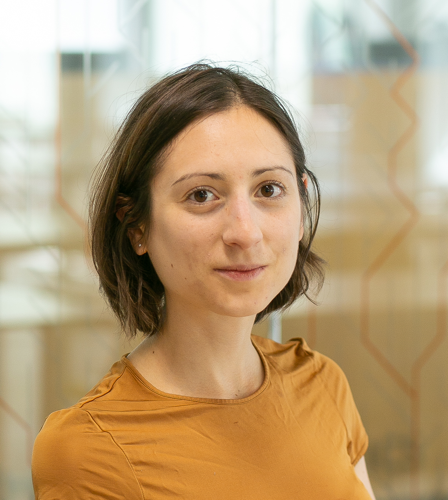

::: {.section_bulletin}
# NEWS FROM THE WORLD {#sec-news}
[Déborah Sulem](deborah.sulem@usi.ch){style="color:white; text-align: center;"}
:::

::: {.column-margin}
{style="float:center;vertical-align:middle;
margin:10px 20px;border-radius: 10px;max-width: 100%;"}
:::

:::{.justify}
## Reports from events and conferences

:::{.center}
**European Seminar on Bayesian Econometrics (ESOBE) 2026 \@Luiss, Roma**  

*by the ESOBE Board*  
:::

{width=45%}

The 16th European Seminar on Bayesian Econometrics (ESOBE) was held at Luiss University in Rome, on 27-28 August ([website](https://esobe2026.github.io/)). Over two days, the program combined keynote lectures by M. Conceptión Ausín (Carlos III, Madrid), Radu Craiu (Toronto) and Petros Dellaportas (UCL and Athens), oral contributed sessions, dedicated sessions for PhD candidates and early-career researchers, and two lunchtime poster sessions. Topics ranged from Bayesian computation and time-series modelling to forecasting, finance, causal inference and machine learning. The breadth of contributions and sustained engagement across formats confirmed the vitality of the ESOBE community.

The 50+ participants were diverse in origin and expertise, representing 14 countries across Europe, North America (Canada and the United States), and Asia (China and Japan), and including academic scholars as well as researchers from US and European central banks. More than half were PhD candidates or early-career researchers, whose participation was supported in part by travel grants from ISBA and its EFaB section. The dedicated sessions and poster slots gave early-career researchers substantial visibility and opportunities for direct exchange with established academics and practitioners. More broadly, the lunches and conference dinner at Villa Ada encouraged informal interaction among participants, helping to strengthen professional networks and the wider ESOBE community.

We would like to thank all participants for their contributions and for making the conference such an engaging event. The ESOBE Board warmly thanks Matteo Iacopini, Alessia Caponera, Marta Catalano and Marco Perone Pacifico for organizing a perfect event. We look forward to meeting again at the next ESOBE 2027 conference in Rotterdam.

:::{.center}
**Bayesian Nonparametric Networking Workshop 2026 \@University of Seoul, Seoul**  

*by Joungyoun Kim*  
:::

{width=50%}

The 4th BNP Networking Workshop was held at the University of Seoul, Korea, from July 6 to 10, 2026, bringing together around 120 researchers and students from the Bayesian nonparametrics community. It was a wonderful week filled with interesting talks, lively discussions, and plenty of opportunities to meet old friends and make new ones. The workshop opened with a welcome reception and poster session, creating a relaxed and lively atmosphere for participants to exchange ideas from the very beginning. We were also very pleased to support the participation of early-career researchers, including students and postdoctoral researchers, through travel grants, helping them take part in the workshop and connect with the broader BNP community.

The week also offered several opportunities to experience Seoul beyond the conference room. During the mid-week excursion, participants visited Changdeokgung Palace, Jogyesa Temple, Insadong, and Namsan, enjoying a mix of Korean history, culture, and city views. The conference banquet was another highlight, featuring a traditional Korean samulnori performance that brought plenty of energy and excitement to the evening. We were delighted to host such a warm and engaged community at the University of Seoul and are very grateful to all the speakers, participants, organizers, volunteers, and sponsors who made the meeting possible. We hope everyone left Seoul with good memories, new ideas, and new connections—and we look forward to meeting again at the next BNP Networking Workshop!

## Upcoming Meetings, Conferences, and Workshops

### ISBA sponsored or endorsed events

- [Mini-symposium on Bayesian Structural Learning](https://symposium-2026.mathsee.kit.edu/101.php), 28-30 September 2026, Karlsruhe Institute of Technology, Karlsruhe, Germany.

- [The Bayesian Biostatistics Meeting (BAYES) 2026](https://www.bayes-pharma.org/), 21-23 October 2026, Leiden, The Netherlands. This meeting is an annual gathering of biostatisticians interested in using Bayesian methods in life science and public health settings.

- [Rethinking the Role of Bayesianism in the Age of Modern AI Workshop](https://workshops.inf.ed.ac.uk/ml/bayesai/), 26-30 October 2026, Edinburgh, UK. This workshop will serve as the inaugural meeting of the ISBA section on Bayesian AI. The gathering will bring together researchers exploring the frontiers of Bayesian machine learning and deep learning in a collaborative atmosphere.

- [International Conference on Statistics, Data Science, and Computing for the Environment and Climate Change (LACSC-TIES-EnviBayes-EnvrASA) 2026](https://isi-web.org/event-detail/664), 7-11 December 2026, Mexico City, Mexico.

- [Bayesian Methods for the Social Sciences 3](https://bayesforshs3.sciencesconf.org/?lang=en), 9-11 December, University College Dublin, Ireland. This 3-day workshop will consist of one day of introductory tutorial sessions, followed by 2 days of talks and posters. The call for posters is open until October 16.

- [International Statistical Ecology Conference (ISEC 2027)](https://statisticalecology.org/#Workshops), 8-15 January 2027, Mérida, Yucatán, México. This is the main international gathering of statistical ecologists and an inclusive interdisciplinary conference at the interface between statistics and ecology. This event is composed of 2-day workshops (8-9 January) followed by the main conference (10-15 January).

- [VIII Latin America Congress on Bayesian Statistics and 18th Brazilian Meeting of Bayesian Statistics](https://cobalebeb2027.softaliza.com.br/), 1-5 March 2027, Armação de Búzios, Rio de Janeiro, Brazil.

- [Bayesian Structural Learning (BAYST) Workshop](https://sites.google.com/view/bayst2027), 1-3 March 2027, Karlsruhe, Germany. This workshop aims to bridge recent advances in Bayesian structural learning with applied sciences, fostering scientific discussion and collaboration between theoretical and applied researchers. Deadline for abstract submission: 30 September.

- [Bayesian Inference for Stochastic Processes 15](https://www.scss.tcd.ie/mimi.zhang/BISP2027/home.html), 31 May - 2 June 2027, Westport, County Mayo, Ireland.

- [Games and Decisions in Reliability and Risk 9](https://www.scss.tcd.ie/mimi.zhang/GDRR2027/home.html), 3-4 June 2027, Westport, County Mayo, Ireland.

- [EnviBayes–INLA Workshop 2027](https://envibayesinla.github.io/workshop2027/), 21-24 June 2027, Glasgow, Scotland, United Kingdom.

- [International Conference on Bayesian Nonparametrics – BNP15 (2027)](https://bnp15.github.io/), 28 June - 02 July 2027, Bergamo, Lombardia, Italy.

### Other events

- [5th International Day of Women in Statistics and Data Science](https://www.idwsds.org/), 6 October 2026, online. The Caucus for Women in Statistics and Data Science (CWS), the Portuguese Statistical Society (SPE), and the American Statistical Association (ASA) organise this fully online conference since 2022 to celebrate the day for Women in Statistics and Data Science (11 October).

- [Frontiers in Statistical Machine Learning (FSML) 2026](https://fsml-ims-workshop.org/), 14 December 2026, Split, Croatia. This workshop aims to spotlight emerging and impactful topics in statistical machine learning that are rapidly evolving but have yet to receive significant attention in leading IMS and ASA publications. It hosts an open call for short paper submissions (deadline 19 October).

- [IMS International Conference on Statistics and Data Science (ICSDS) 2026](https://sites.google.com/view/ims-icsds2026/home), 15-18 December 2026, Split, Croatia.

- [International Indian Statistical Association (IISA) 2026 conference](https://www.intindstat.org/conference2026/index), 26-30 December 2026, Varanasi, India.
:::