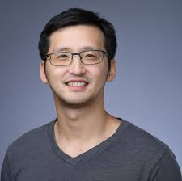

:::{.section_bulletin}
# FROM THE PROGRAM COUNCIL  {#sec-pc}
[Yang Ni](mailto:program-council@bayesian.org){style="color:white; text-align: center;"}
:::

::: {.column-margin}
{style="float:center;vertical-align:middle;
margin:10px 20px;border-radius: 10px;max-width: 100%;"}
:::

 

:::{.justify}
**New Member.** David Frazier has joined the Program Council as our new Vice-Chair. We are thrilled to welcome him to this role and look forward to the energy he brings to the team. We also want to express our deepest gratitude to Sergios Agapiou for his dedication and exceptional service over the past three years. Sergios has been instrumental in organizing multiple World Meetings all the way through 2030. Thank you, Sergios, for your incredible impact, and a very warm welcome to David!

**(Co)-sponsorship & Endorsement Requests.** If you are planning a meeting and would like to request
financial sponsorship (or co-sponsorship) or non-financial endorsement from ISBA, please submit
your request to the Program Council at <program-council@bayesian.org>. Detailed information on how to submit
requests for sponsorship or endorsement is available [here](https://bayesian.org/events/request-sponsorshipendorsement/).

**Upcoming ISBA-Sponsored/Endorsed Events.** In 2026, ISBA will sponsor or endorse many exciting events in 2026. You can find all the details in the [*News from the World*](#sec-news) section of this bulletin.
:::

