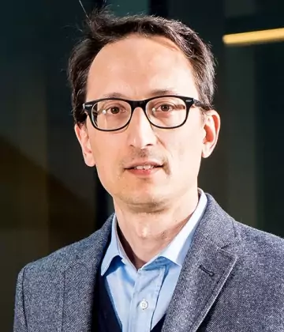

:::{.section_bulletin}
# MESSAGE FROM THE PRESIDENT  {#sec-pres}
[Antonio Lioji](mailto:president@bayesian.org){style="color:white; text-align: center;"}
:::

::: {.column-margin}
{style="float:center;vertical-align:middle;
margin:10px 20px;border-radius: 10px;max-width: 100%;"}
:::

 

:::{.justify}
Welcome to the second ISBA Bulletin of 2026!

By the time this issue reaches you, the event many of us have been looking forward to for the past two years will be just around the corner: the ISBA World Meeting in Nagoya. As I write these lines, preparations are entering their final stages, and this seems like the perfect opportunity to thank all those who have contributed to making this meeting possible. Local organizers, members of the Scientific Committee and the Committee on Named Lectures, the ISBA Administrator, the ISBA Executive Committee, and the many volunteers serving on committees and award panels have all devoted a tremendous amount of time and energy to this event. If I am forgetting someone, my apologies, but I really want to emphasize that the success of this meeting is truly the result of a collective effort across the Society.

And what a meeting it promises to be. With 874 registered participants one week before the start of the conference, Nagoya will become the largest in-person ISBA World Meeting ever organized. This is a remarkable milestone for our community. It is worth remembering that the first World Meeting, held in Valencia in 1993, attracted around 200 participants. The growth of ISBA over the past three decades has been extraordinary, and the Nagoya meeting is yet another sign of the vitality of our community.

The scientific program reflects this vitality. Participants will enjoy 61 invited sessions, 9 contributed sessions, and 386 posters distributed across three poster sessions. We will hear the de Finetti Lecture by Peter Müller, the 2024 and 2026 Bayarri Lectures by Stéphanie van der Pas and Daniele Durante, respectively, and Foundation Lectures by Sylvia Richardson, David Dunson, Hal Stern, and Sid Chib. Barbara Engelhardt, Botond Szabó, Fumiyasu Komaki, and Emtiyaz Khan will deliver keynote talks. The meeting will also feature a short course on Bayesian Deep Learning by Julyan Arbel, the always highly anticipated Savage Award sessions, and the poster sessions, which remain among the best opportunities to discover new ideas and meet emerging researchers.

Nagoya will also provide an opportunity to remember colleagues who have left a lasting mark on our community. The program includes memorial sessions honoring Harry van Zanten and Herman van Dijk, whose scientific contributions and personal generosity will be greatly missed.

Continuing a long-standing ISBA tradition, we were able to support the participation of early-career scholars and PhD students from our community. Thanks to our sponsors, 97 participants have received financial support to attend the meeting. Encouraging the participation of students and young researchers remains one of the most important investments we can make in the future of our Society.

Of course, World Meetings are about much more than scientific talks. They are opportunities to reconnect with old friends, meet new colleagues, and strengthen the sense of community that has always characterized ISBA. I hope many of you will join the Welcome Reception on June 28 and the Banquet on July 3, where we will celebrate the achievements of our award recipients and newly elected Fellows. I would also encourage you to attend the ISBA General Assembly on July 2, where we will discuss the activities and future directions of the Society.

Another event of interest is the lunch session on the Future of ISBA Meetings. The session will present the results of the survey conducted by the *ad hoc* committee on this topic. I would like to thank Guido Consonni, Kate Lee, Gertraud Malsiner-Walli, and Christian Robert for their thoughtful work. As our community continues to grow, questions of accessibility, sustainability, and inclusiveness become increasingly important, and the survey provides valuable guidance for future discussions. You will find further details in the article contributed by the committee in this issue of the Bulletin.

As always, the World Meeting will be surrounded by a number of satellite events. Immediately before Nagoya, Chiba University will host the *10th Bayesian Young Statisticians Meeting* (BAYSM 2026). After the conference, participants will have the opportunity to attend the meeting on *Information Geometry, Privacy, and Monte Carlo* at the Institute of Statistical Mathematics in Tokyo, as well as the *4th BNP Networking Conference* at the University of Seoul.

Whether you are joining us in Nagoya or are unable to attend this year, I hope you enjoy this issue of the Bulletin. For those traveling to Japan, I wish you a safe journey and look forward to seeing you very soon. For those who cannot be with us this time, I hope to meet you at a future ISBA event.
:::
