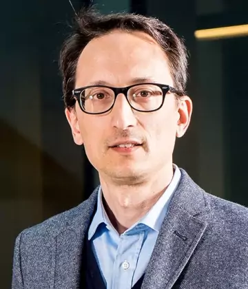

:::{.section_bulletin}
# MESSAGE FROM THE PRESIDENT  {#sec-pres}
[Antonio Lijoi](mailto:president@bayesian.org){style="color:white; text-align: center;"}
:::

::: {.column-margin}
{style="float:center;vertical-align:middle;
margin:10px 20px;border-radius: 10px;max-width: 100%;"}
:::

 

:::{.justify}

Dear ISBA members, I hope you all had a relaxing summer break and have started the new academic year with renewed energy. For the ISBA community, this was certainly a special summer, with the World Meeting in Nagoya providing a memorable start.

As anticipated in the June issue of the Bulletin, Nagoya 2026 became the largest in-person World Meeting in ISBA history, with almost 900 registered participants. More importantly, it was a wonderful week of science, conversations, old friendships, and new connections. The success of the meeting was the result of an extraordinary collective effort. My heartfelt thanks go to the Local Organizing Committee, led by Kazuhiko Kakamu and Makoto Takahashi, and to the Scientific Committee, led by Sameer Deshpande. The Scientific Committee and the Committee on Named Lectures deserve special recognition for putting together an outstanding scientific program, with wonderful speakers delivering a series of exciting and inspiring talks throughout the week. As always in ISBA, a great deal of work was also carried out by those who served on prize committees and in many other roles before and during the meeting. Many thanks also to all the participants who traveled from all over the world and contributed to making it such a special conference.

The banquet on Friday evening provided a fitting conclusion to the week. It began with the traditional sake ceremony and a toast by our Past President, Michele Guindani, and continued with the celebration of ISBA award recipients and our newly elected Fellows. You can read more about these recognitions in the contributions by Igor Prünster, Maria De Iorio, Natalia Bochkina, and Botond Szabó in this issue of the Bulletin. And beyond the science and awards, I suspect that many of us will also miss the warm hospitality of our Japanese colleagues and, in my case at least, the sushi in Nagoya!

The 2026 World Meeting may have only just ended, but ISBA is already looking ahead. Our next World Meeting will take place in Milwaukee on June 18-23, 2028, and both the ISBA Program Council and the Local Organizing Committee, led by Rodney Sparapani, are already at work. 

At the General Assembly in Nagoya, Rod gave us a first glimpse of Milwaukee and the plans for the 2028 meeting. We also announced that the 2030 World Meeting will be held in Valencia, Spain, on July 1–6. The Local Organizing Committee is led by Anabel Forte, who presented the plans for that edition and offered an introduction to Valencia and the meeting. Two exciting World Meetings are therefore already ahead of us, and we will soon start looking even further into the future with a call for proposals for the 2032 World Meeting.

The General Assembly also gave us an opportunity to reflect on our membership, currently above 1,100, and to take stock of our Sections. BayesComp, j-ISBA, and BNP are currently among the largest, though the picture across Sections is quite diverse. One message I took away from the discussion is that more regular interaction between ISBA leadership and the Sections would be useful. Our Sections are one of the main engines of scientific activity within the Society, and maintaining a strong connection with them will remain an important priority. In Nagoya, members of the ISBA Executive Committee also met with Section leaders, and I would like to see meetings of this kind take place more regularly in the future.

This issue of the Bulletin also includes an ISBA statement on compulsory Article Processing Charges (APCs). The statement addresses a broader concern about publishing models in which authors are required to pay compulsory APCs, with the recent developments at *Statistics and Computing* providing a concrete example particularly relevant to our community. Indeed, a substantial number of Associate Editors of the journal decided to step down in response to the publisher's decision to impose APCs on papers submitted after July 1, 2026. You can find more details in [Robin Ryder's blog](https://robinryder.wordpress.com). ISBA strongly supports open access, but we also believe that removing barriers for readers should not create new ones for authors. Our own flagship journal, *Bayesian Analysis*, shows that open access can be provided without compulsory publication charges for authors.

Speaking of *Bayesian Analysis*, there is more good news. By the end of August, the journal had already received almost as many submissions as during the whole of 2025. Despite this substantial increase in workload, turnaround times have remained below four months. This is an impressive achievement, and I would like to thank the Editor, Co-Editors, Associate Editors, and reviewers for the time and energy they devote to the journal. You can read more about these developments in Igor Prünster's column in this issue.

Let me also remind you that the ISBA elections will open soon. The slates of candidates will shortly be announced, together with candidate profiles to help you make an informed choice. Elections are an important moment for our community: the colleagues we elect will help shape the scientific activities and priorities of ISBA over the coming years, so I strongly encourage everyone to participate. Only current ISBA members can vote, so this is also a good opportunity to check your membership status and renew if necessary through the dedicated ISBA [website](https://bayesian.org/membership/joinrenew/). And, while you are there, you may even want to take care of your 2027 membership a little early! As we speak of membership, please encourage your students, collaborators and colleagues to join our Society.

Finally, I am pleased to welcome Luis Enrique Nieto-Barajas as a new member of the ISBA Committee on Constitution and Bylaws. Many thanks to Luis for agreeing to serve. The work of committees such as this one may be less visible than a World Meeting or an award ceremony, but it is essential to the good functioning of our Society.

Nagoya reminded us once again how much energy there is in the ISBA community. I hope you enjoy this issue of the Bulletin, and I look forward to seeing many of you at our upcoming events around the world.
:::
