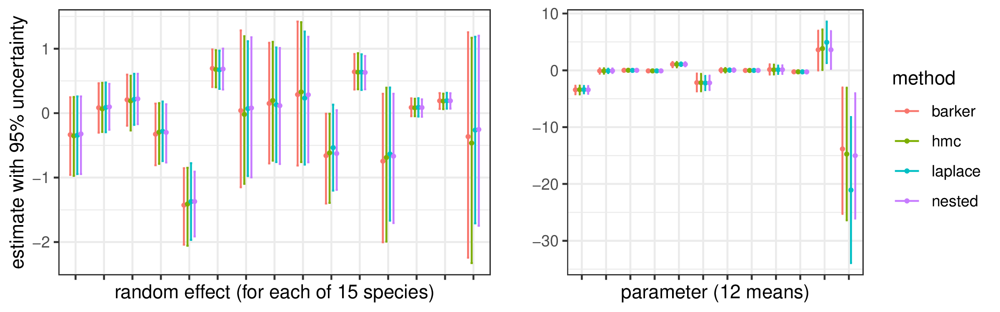

<br>


NIMBLE ([r-nimble.org](https://r-nimble.org)) is a system, first released in 2014, for building and sharing analysis methods for statistical models, especially for hierarchical models and computationally-intensive methods. NIMBLE is built in R but compiles models and algorithms using C++ for speed [@de2017programming]. 

NIMBLE includes three components:

1. A system for writing models in the JAGS/BUGS-compatible NIMBLE model language.
2. A language embedded in R for programming algorithms for models, including general support for automatic differentiation (AD; via the `CppAD` library) and with both models and algorithms compiled through C++ code and loaded into R.
3. An extensive library of built-in algorithms, including:
   - MCMC, which can be used directly or after customizing sampler choice,
   - Hamiltonian Monte Carlo (via the `nimbleHMC` package),
   - sequential Monte Carlo (via the `nimbleSMC` package),
   - Laplace and adaptive Gauss-Hermite quadrature (AGHQ) approximation and an INLA-like nested approximation (via the `nimbleQuad` package),
   - and support for specialized components including Dirichlet process-based nonparametric distributions, conditional auto-regressive models, and reversible jump for variable selection.


NIMBLE has some key features in comparison with other probabilistic programming systems, and with method- or model-specific software packages, that can make it a good choice for various problems. First, by providing easy-to-use implementations of a variety of modern methods, one can easily try out different methods on a model, without having to switch systems or recode the model. For MCMC, the system provides particular flexibility: users can mix-and-match various built-in samplers (e.g., conjugate/Gibbs, slice, Metropolis-Hastings, Barker, Pólya-gamma, HMC) within a single MCMC as well as adding their own samplers. Second, NIMBLE's algorithms are written in an R-like syntax, so it is generally straightforward for users to inspect, modify, extend, add, and combine algorithms. In addition to standard mathematical and statistical operations, one can use AD to get derivatives (including Hessians and third-order derivatives) with respect to both functions and model log-probabilities for use in algorithms. Finally, the model language is a slight variation (including various enhancements) on that used in BUGS and JAGS that also allows one to easily define new functions and distributions, including a macro functionality for shorthand code for more complicated motifs.

While NIMBLE is often used with Bayesian hierarchical models, it is not only for Bayesian models and not only an MCMC engine. For example, one can use Laplace (and more general AGHQ) approximation for approximate maximum likelihood estimation and one can build other non-Bayesian algorithms (e.g., our implementation of Monte Carlo EM uses NIMBLE's MCMC engine for the E-step and NIMBLE's optimization and AD capabilities for the M-step). NIMBLE's newest algorithm is an INLA-like deterministic nested posterior approximation whose methodology borrows heavily from both INLA [@rue2009approximate] and the extended latent Gaussian models approach implemented in the `aghq` package in R [@stringer2023fast] to produce deterministic univariate marginals for parameters and joint posterior samples for latent variables (and optionally for parameters) [@nqvignette]. NIMBLE has seen its most widespread adoption in the field of ecology (where the ability to very flexibly specify a model for complicated data, including discrete parameters, is often critical), but it is a general purpose system and has been used for problems in a wide variety of disciplines. 

One additional area of use is for teaching. Students can easily define a probabilistic model and fit the model using various methods, including exploring different MCMC samplers. It is straightforward to look at the R-based internal implementations, including modifying an implementation to create an alternative algorithm that can then be as easily used as NIMBLE's built-in algorithms. 

NIMBLE does have some limitations, which we are working to improve in a heavily-revamped NIMBLE 2.0. First NIMBLE is primarily for serial (non-parallel) execution, though some parallelization of MCMC chains and threaded linear algebra is possible. Second, NIMBLE does not scale well to large problems in some cases, particularly with large numbers of nodes in the graphical structure of the model (e.g., hundreds of thousands of nodes), although some tricks can help improve performance (e.g., combining nodes into larger non-scalar nodes as seen in the example). Third, because NIMBLE compiles the model and algorithm code to C++ and then machine code, there is some initialization overhead, particularly for larger models. In return, though, users have full control over defining essentially arbitrary models and algorithms.

NIMBLE 2.0 will be based on a new `nCompiler` package that thoroughly redesigns the NIMBLE compilation system, in particular providing a general-purpose tool to define functions and classes in R that will be compiled to C++, leveraging the capabilities of `Rcpp` and `Eigen`, plus parallelization via the `TBB` library. `nCompiler` will interface with a new (internal) NIMBLE model structure  that represents nodes in the model graph more compactly. It should greatly improve NIMBLE's scalability and make for a better programming experience in the NIMBLE system, including using NIMBLE to build one's own package (e.g., using NIMBLE's MCMC engine or AD system within a package that implements an algorithm).

## Example: one model, many methods

We fit a multi-species occupancy model (MSOM) using multiple methods: NIMBLE's general MCMC system, HMC, Laplace approximation and nested deterministic posterior approximation. Occupancy models are used in ecology to analyze the presence of animal species in relation to covariates across multiple locations (sites) under imperfect detection, disentangling presence from detection based on replication in time. The models involve two binary regression components, one for detection given presence (occupancy) and a second for occupancy, with each related to covariates. MSOMs add an additional layer of analyzing multiple species, generally tied together using species-level random effects.

We fit an MSOM to 15 carnivore species in northern California, using camera trap data collected by the California Department of Fish and Wildlife (CDFW) [@furnas2022intermediate], using seven occupancy covariates and five detection covariates. Here is the model code, which is specified using NIMBLE's model language and comes from a specific analysis done in collaboration with CDFW, but the model code is easily altered for model variations. 

```{r}
#| eval: false
code <- nimbleCode({   # Model code is specified in R.
  # (hyper)parameter priors
  for(k in 1:k_occ) {
    mu_occ[k] ~ dnorm(0, sd = 100) # Various parameterizations possible; `sd` here.
    sd_occ[k] ~ dunif(0, 100)      # Avoid inverse-gamma priors per Gelman (2006).
  }
  for(k in 1:k_detect) { 
    mu detect[k] ~ dnorm(0, sd = 100)
    sd detect[k] ~ dunif(0, 100)
  }
  for (i in 1:n_species) {
    # Random effects distributions for regression coefficients.
    for(k in 1:k_occ)
      beta_occ[k, i] ~ dnorm(mu_occ[k], sd = sd_occ[k])
    for(k in 1:k_detect)
      beta_detect[k, i] ~ dnorm(mu_detect[k], sd = sd_detect[k])

    # Probability of occupancy with covariates varying by site.
    logit(prob_occ[1:n_sites,i]) <- X_occ[1:n_sites,1:k_occ] %*% beta_occ[1:k_occ,i]

    # Probability of detection, covariates varying by site-time or site-time-species.
    logit(prob_detect[1:n_sites, 1:max_num_sites, i]) <- beta_detect[1,i] +
      beta_detect[2,i] * X_detect1[1:n_sites,1:max_num_sites] +
      beta_detect[3,i] * X_detect2[1:n_sites,1:max_num_sites] +
      beta_detect[4,i] * X_detect3[1:n_sites,1:max_num_sites] +
      beta_detect[5,i] * X_detect4[1:n_sites,1:max_num_sites,i]
    
    ## User-defined vectorized distribution for obs. matrix, one term per species.
    y[1:n_sites, 1:max_num_sites, i] ~ dOcc_multisite(
      probOcc = prob_occ[1:n_sites,i],
      probDetect = prob_detect[1:n_sites, 1:max_num_sites, i],
      reps = reps[1:n_sites],  # Number of time points per site.
      n_sites = n_sites)
  }})
```

This is a marginalized version of the model. One could also use MCMC, but not HMC (nor Laplace-based methods), to fit a latent-variable version of the model with indicator variables representing presence of a species at a site. In previous work we found generally better MCMC performance using the marginalized model (i.e., summing over the discrete latent variable values). The marginalized distribution for the observations is not a built-in distribution, so we need to write a user-defined distribution. Here we extend the occupancy distribution defined in the `nimbleEcology` package (`nimbleEcology::dOcc_v`) to create a vectorized distribution over sites (`dOcc_multisite`), writing the joint density for the observation matrix (site by replicate), shown in detail later. This reduces the size of the model graph to improve compilation efficiency by reducing overhead in NIMBLE (which creates objects for every node in the graph). 

We first define a model object in R (with a corresponding compiled version of the model):

```{r}
#| eval: false
model <- nimbleModel(code, data = list(y = y),
                     constants = list(n_sites = n_sites, n_species = n_species,
                       max_num_sites = max_num_sites, reps = reps, k_occ = k_occ,
                       k_detect = k_detect, X_occ = X_occ,
                       X_detect1 = X_detect1, X_detect2 = X_detect2,
                       X_detect3 = X_detect3, X_detect4 = X_detect4),
                     inits = inits, buildDerivs = TRUE)  # Inits not shown here.
cmodel <- compileNimble(model)   # Compiled (C++) version of the model.
```

Now we fit the model using the various methods chosen. We retain only key illustrative output. First we use HMC:

```{r}
#| eval: false
library(nimbleHMC)
monitors <- c('mu_occ','sd_occ','mu_detect','sd_detect','beta_occ','beta_detect')
conf <- configureHMC(model, control = list(warmupMode = 'iterations',
                     warmup = 1000), monitors = monitors)
hmc <- buildMCMC(conf)
chmc <- compileNimble(hmc, project = model)
samples_hmc <- runMCMC(chmc, niter = 6000, nburnin = 1000)
```

Next we exploit NIMBLE's flexible MCMC system to define  a customized MCMC sampler configuration to improve MCMC efficiency (defined as effective sample size per minute), specifically using slice sampling for the random effect standard deviations, conjugate (Gibbs) samplers for the random effect means, and Barker sampling [@livingstone2022barker] for blocks of the random effects, as developed in previous work. The Barker sampler is a gradient-based adaptive Metropolis-Hastings algorithm that provides more robustness to tuning than Metropolis-adjusted Langevin sampling and is less computationally intensive than HMC.


```{r}
#| eval: false
# Set up initial MCMC sampler config just on the means (NIMBLE detects conjugacy).
conf <- configureMCMC(model, nodes = c('mu_occ','mu_detect'), monitors = monitors)
sd_nodes <- model$expandNodeNames(c('sd_occ','sd_detect'))
for(node in sd_nodes) 
  conf$addSampler(node, type = 'slice')  # Slice sampling for variance components.
for (i in 1:n_species){
  # Specialized block (Barker) sampling for random effects (regression coefficients),
  # with a block for each species within each logistic regression component.
  blockNodes <- model$expandNodeNames(paste0('beta_occ[,',i,']'))
  conf$addSampler(blockNodes, type = 'barker')
  blockNodes <- model$expandNodeNames(paste0('beta_detect[,',i,']'))
  conf$addSampler(blockNodes, type = 'barker')  }

mcmc <- buildMCMC(conf)
cmcmc <- compileNimble(mcmc, project = model)
samples_custom <- runMCMC(cmcmc, 25000, nburnin = 2000)
```

Next we use (approximate) maximum likelihood estimation via Laplace approximation.

```{r}
#| eval: false
library(nimbleQuad)
laplace <- buildLaplace(model, control = list(ADuseNormality=FALSE))
## `ADuseNormality=FALSE` changes configuration to use AD for all derivatives
## rather than analytically-determined for Gaussian distributions, which allows
## use of more efficient AD-based gradient of Laplace approximation in optimization.
claplace <- compileNimble(laplace, project = model)
fit_laplace <- runLaplace(cmLaplace)
```

Finally, we apply NIMBLE's nested posterior approximation.

```{r}
#| eval: false
library(nimbleQuad)
fit_approx <- buildNestedApprox(model, control=list(ADuseNormality=FALSE))
```

`buildNestedApprox` reports the automated determination of parameters versus latent nodes,
and conditional independence between species allows use of 15 smaller Laplace approximations rather than one large approximation
(improving efficiency), also the case for Laplace approximation above.


```
Building nested posterior approximation for the following node sets:
  - parameter nodes: mu_detect (5 elements), mu_occ (7 elements), sd_detect ...
  - latent nodes: beta_detect (75 elements), beta_occ (105 elements)
  with CCD grid for the parameters and Laplace approximation for the latent nodes.
  [Warning] There is a large number of parameter nodes. Computation may be slow.
Building 15 individual Laplace approximations (one dot for each): ...............
```
```{r}
#| eval: false
capprox <- compileNimble(approx, project = model)
results <- runNestedApprox(capprox)
samples_nested <- results$sampleLatents(500)
```

Here are the estimates, with uncertainty, for one of the detection coefficients (for all 15 species) and for the 12 random effect means.

:::{.column width=100%}

:::

Here are some high-level comments comparing fitting using the four approaches:

- HMC took 290 minutes to generate 6000 samples, while our customized sampler took 55 minutes to generate 25000 samples. The effective sample sizes per minute varied by parameter but were generally 2-50 times larger with the customized sampler than HMC. We are not claiming that a customized approach will generally outperform HMC (and indeed effort is involved to determine the customization), but we have found various cases where other MCMC configurations do markedly better than HMC.
- Laplace-based maximum likelihood estimation took 9 minutes. The standard errors for the estimates were generally a bit smaller than the MCMC-based posterior standard deviations. One potential use for Laplace is for initial model selection and determining starting values, with MCMC reserved for one or a small number of "final" models.
- Nested posterior approximation approach is slow with this model because it has 24 hyperparameters. While an initial approximation to the joint hyperparameter posterior (using the integration-free method developed for INLA [@martins2013bayesian]) is feasible (taking 17 minutes), improvement via AGHQ marginalization for the univariate marginals is not computationally feasible, while sampling for the latent values is slow (83 minutes) because the method evaluates the Laplace approximation at 1073 hyperparameter grid points (using the CCD grid pioneered by INLA). The approximate posterior credible intervals are reasonably consistent with the MCMC-based estimates but in some cases are too narrow. 


## Extending the NIMBLE model language

As discussed, a key feature of NIMBLE is the ability to extend the model language with custom distributions and functions. As an example, here is the `dOcc_multisite` distribution that we wrote for the MSOM example that marginalizes over latent variables for presence of a species at a site and does so jointly for all sites at once. 

```{r}
#| eval: false
dOcc_multisite <- nimbleFunction(run =  
  function(x = double(2), probOcc = double(1), probDetect = double(2),
    reps = double(1), n_sites = integer(0), log = logical(0, default = TRUE)) {  
    returnType(double(0))   # Return type annotation for compilation to C++.
    logProb <- 0
    for(j in 1:n_sites) {
      nrep  <- ADbreak(reps[j])   # Avoid differentiation w.r.t. `reps[j]`.
      logProb_x_given_occupied <- 0
      prob_x_given_unoccupied <- 1
      for(i in 1:nrep) { 
        x_ji <- ADbreak(x[j,i]) # Avoid differentiation w.r.t. x[j,i].
        if(!is.na(x_ji)) { 
          logProb_x_given_occupied <- logProb_x_given_occupied +
            dbinom(x[j,i], prob = probDetect[j,i], size = 1, log = TRUE)
          if(x_ji == 1) prob_x_given_unoccupied <- 0
        }
      }
      logProb <- logProb + log( exp(logProb_x_given_occupied) * probOcc[j] +
                    prob_x_given_unoccupied * (1 - probOcc[j]) )
    }
    if(log) return(logProb) else return(exp(logProb))
  }, buildDerivs = list(run = list(ignore=c('i','j','x_ji','nrep')))) # Ignore in AD.
```

The distribution is written as "nimbleFunction", which is a function written in the NIMBLE algorithm language, an enhanced subset of R syntax from which NIMBLE can generate C++ code. Some type annotation is required to assist NIMBLE's compilation to statically-typed C++ code. This particular nimbleFunction supports AD, which is needed for use with derivative-based algorithms such as those used in the example. One can define the nimbleFunction in a user session and the NIMBLE compilation system will find it when compiling the model.


## Writing new methods

For new general or application-specific methods, a key aspect of NIMBLE is the ability to write your own algorithms, either in whole, as a part of a NIMBLE-provided algorithm, or by combining pieces from existing algorithms in NIMBLE, all while leveraging NIMBLE's model infrastructure. Examples include user-defined functions in model specifications, user-defined MCMC samplers for use within the NIMBLE MCMC engine, and more general algorithms, all implemented using one or more nimbleFunctions. These nimbleFunctions are similar to the user-defined distribution above, but with some additional structure.

As illustration, we write a simplified version of the Barker sampler. Of course this sampler exists in the NIMBLE MCMC sampler library, but any NIMBLE user could write this sampler if it were not already provided. A user-defined MCMC sampler can be used in combination with the standard samplers provided by NIMBLE without any additional steps, with NIMBLE's MCMC engine applying all the samplers in an MCMC configuration to carry out a complete MCMC algorithm. 

In general, nimbleFunctions have "setup" code, written in R, that allows an algorithm to be applied (specialized) to any model. For example, for an MCMC sampler, the setup code uses NIMBLE's model processing functionality to determine relationships amongst nodes in the model graph to determine what nodes are involved in the specific calculations of the sampler (e.g., child nodes when setting up a Metropolis sampler for a specific parameter). Then the "run" code implements the algorithm  in a model-agnostic way using "generic" variables defined in the setup code, via one or more functions (methods) written in the NIMBLE algorithm language. For the Barker sampler, we have a main `run` function and auxiliary functions that carry out specific calculations: calculating the log-density (`calcLogProb`), the gradient (`gradient`), parameter transformation (to the real line)(`inverseTransformStoreCalculate`), and adapting the proposal covariance (`adaptPropCov`). 

```{r}
#| eval: false
sampler_barker <- nimbleFunction(
  contains = sampler_BASE,  # Required class inheritance for NIMBLE's MCMC engine
  setup = function(model, mvSaved, target, control) {
    ## Set algorithm control knobs.
    scale <- 1; sigma <- 0.1; adaptIntervalCov <- 10
    adaptFactorExponent <- 0.6  # Per Livingstone & Zanella 2022.
    targetAcceptanceRate <- 0.574 # Vogrinc et al. 2023 (10.1093/biomet/asac056).

    ## Determine relevant nodes in the model:
    targetNodes <- model$expandNodeNames(target)  # Nodes being sampled.
    targetScalars <- model$expandNodeNames(target, returnScalarComponents = TRUE)
    calcNodes <- model$getDependencies(targetNodes)  # Child nodes of parameter(s).

    ## Determine bounds and transformations as sampler works on whole real line.
    my_parameterTransform <- parameterTransform(model, targetScalars)
    d <- my_parameterTransform$getTransformedLength()
    nimDerivs_wrt <- 1:d
    ## Set up node information needed for AD using boilerplate code.
    derivsInfo_return <- makeModelDerivsInfo(model, targetNodes, calcNodes)
    nimDerivs_updateNodes   <- derivsInfo_return$updateNodes
    nimDerivs_constantNodes <- derivsInfo_return$constantNodes

    ## Omitted: declaration of data structures: `propCov`, `empirSamp`, etc.
  },
  run = function() {
    current <- my_parameterTransform$transform(values(model, targetNodes))
    currentLogDetJacobian <- my_parameterTransform$logDetJacobian(current)

    ## Implement Barker proposal following Livingstone and Zanella (2022).
    gradCurrent <<- gradient(current)
    z <- scale * rnorm(d, sqrt(1-sigma^2), sigma)
    noflipProb <- expit((U%*%gradCurrent)[,1]*z)
    noflip <- 2 * (runif(d) < noflipProb) - 1
    diff <- noflip * z
    proposal <- current + (t(L) %*% diff)[,1]
    values(model, targetNodes) <<- my_parameterTransform$inverseTransform(proposal)

    ## Determine accept/reject.
    gradProposed <<- gradient(proposal)
    newLogDetJacobian <- my_parameterTransform$logDetJacobian(proposal)
    lpD <- model$calculateDiff(calcNodes) + newLogDetJacobian -
        currentLogDetJacobian + calculateLogHastingsRatio(diff)
    jump <- decide(lpD)

    ## Cache current model state in a `modelValues` structure (required).
    if(jump) nimCopy(from=model, to=mvSaved, row=1, nodes=calcNodes, logProb=TRUE)
    else     nimCopy(from=mvSaved, to=model, row=1, nodes=calcNodes, logProb=TRUE)
    adaptPropCov(min(1,exp(lpD))
  },
  methods = list(
    gradient = function(values = double(1)) {
      # Use NIMBLE AD system for first deriv. of model log-density w.r.t. params.
      derivsOutput <- nimDerivs(calcLogProb(values), order = 1, wrt = nimDerivs_wrt,
                                model = model, updateNodes = nimDerivs_updateNodes,
                                constantNodes = nimDerivs_constantNodes)
      returnType(double(1))
      return(derivsOutput$jacobian[1, 1:d])
    },
    inverseTransformStoreCalculate = function(values = double(1)) {
      values(model, targetNodes) <<- my_parameterTransform$inverseTransform(values)
      return(model$calculate(calcNodes))
      returnType(double())
    },
    calcLogProb = function(values = double(1)) {
      return(inverseTransformStoreCalculate(values) +
             my_parameterTransform$logDetJacobian(values))
      returnType(double())
    },       
    calculateLogHastingsRatio = function(diff = double(1)) {
      ## Not shown: code to calculate Hastings adjustment for accept/reject decision.
    },
    adaptPropCov = function(acceptProb = double()) {
      ## Not shown: code to adapt proposal covariance.
    },
    reset = function() {
      ## Not shown: boilerplate code to reset sampler state required for NIMBLE MCMC.
    }
  ),
  buildDerivs = list(
    inverseTransformStoreCalculate = list(), calcLogProb = list(), gradient = list()
  ))
```

All the algorithms in NIMBLE's algorithm library are defined using nimbleFunctions and found in the `nimble` package source code's `R` directory.


### References

<div class="small-refs">
::: {#refs}
:::
</div>
