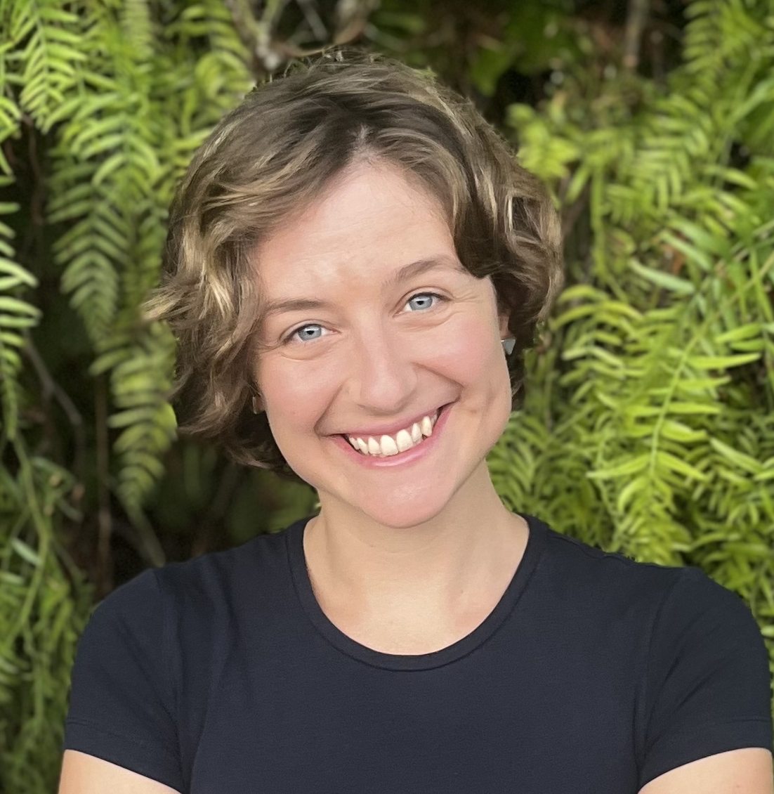

:::{.section_bulletin}
# TEACHING BAYES {#sec-teach}
[Federica Zoe Ricci](mailto:fricci1@swarthmore.edu){style="color:white; text-align: center;"}
:::
  
::: {.column-margin}
{style="float:center;vertical-align:middle;
margin:10px 20px;border-radius: 10px;max-width: 100%;"}
:::
  
 
  
:::{.justify}
In this issue, we share the reflections of two statistics researchers and teachers with many years of experience introducing Bayesian ideas to undergraduate students in statistics and data science. But first, here are some news and upcoming deadlines for Bayesian educators:

- The Journal of Statistics and Data Science Education has recently published an [interview with Jim Albert](https://www.tandfonline.com/doi/full/10.1080/26939169.2025.2503104), who shares his experience introducing statistical reasoning to beginners using the Bayesian approach and points to useful articles and tools. By Juana Sanchez (UCLA) and Jeff Witmer (Oberlin College).

- The [US Conference on Teaching Statistics](https://www.causeweb.org/cause/uscots/uscots25/registration) will take place at Iowa State University in Ames, IA, from July 17th-19th, with pre-conference events starting on July 15th. There is still time to register! 

- The [International Conference on Teaching Statistics](https://virtual.oxfordabstracts.com/e/icots12) will be held in Brisbane, Australia, July 12-17, 2026. The first deadline (for main topic paper proposals) is July 31 2025.

- Every year, the Section on Statistics and Data Science Education (SSDSE) of the ASA grants funds to promote the initiatives of the section. The deadline to [submit an application](https://docs.google.com/forms/d/e/1FAIpQLSdve9aYK_Bt1En3V6M26oWueSeG7FC1_51GyOIae2TWmysZ6w/viewform) is August 15, 2025.

### Teaching Bayesian Thinking: a Conversation with Jeff Witmer and Daniel Kaplan

**Jeff Witmer**, Professor of Statistics at Oberlin College, is a 2025 ASA Founders Award recipient and a former editor of the *Journal of Statistics and Data Science Education*. He has written extensively on Bayesian education, including the articles "Bayes and MCMC for Undergraduates" (*The American Statistician*, 2017) and "To Bayes or Not to Bayes? (The Answer Is Yes)" (in the *International Handbook of Research in Statistics Education*, 2017).

**Daniel Kaplan** is DeWitt Wallace Professor Emeritus at Macalester College and author of *Modern Data Science with R*. He received the CAUSE Lifetime Achievement Award in Statistical Education in 2017. Trained as a signal-processing biomedical engineer, Kaplan brings a distinctive interdisciplinary perspective to statistical thinking and curriculum development.

#### 1. Bayes Before It Was Cool
*What was your early experience with Bayesian education?*

**JW:** Back when I was a student it was fun to talk about Bayesian ideas, but applications were pretty much limited to the Normal-Normal (prior-and-likelihood) or Beta-Binomial settings. Don Berry wrote an introductory textbook in 1996 based on Bayesian methods and Jim Albert wrote some Minitab macros that could be used with Berry’s book, but we were confined to looking at one or two means, or one or two proportions.

  

**DK:** I was trained as a signal-processing biomedical engineer, where Bayesian reasoning is used routinely - for example, in Kalman Filtering or generating diagnoses. So I was bewildered when I entered the Stat Ed world and found out that 1) most statisticians knew little about Bayes and 2) it was widely regarded as suspect. 

#### 2. Introducing Bayesian Ideas in Non-Bayesian Courses
*How do you introduce Bayesian thinking into your teaching?*

**DK:** Since the textbooks were all Frequentist, I taught in that mode, but with some small deviations to save my sanity. For example, I learned that teaching about hypothesis testing is much more successful if one first teaches a simple Bayesian process, which, as has often been said, is intuitive and in fact the way many professionals misinterpret p-values. Hypothesis testing makes sense only if you first understand that it doesn't make sense!  
I developed a liberal arts course in epidemiology, which was a great context to introduce Bayesian terminology because it is so close to intuitively accessible concepts: prevalence of disease; sensitivity and specificity of tests. Prevalence plays the role of a prior. Sensitivity and specificity are... think about it... likelihoods.  
The traditional way in which the Bayes formalism is taught - $p(A | B)$, $p(B | A)$, where likelihood is presented as a probability - adds a lot of cognitive load and potential for confusion ("inverse probability"?).  
Instead, I preferred to use a planetary metaphor.  
Each planet stands for a hypothesis. You have some data from Earth. When you want to check out a hypothesis, you leave Earth and travel to that planet. On that planet, you compare your Earthly data to the kinds of things you see happening around you on the planet. If you want to compare hypotheses, you need to travel to different planets. As for sensitivity and specificity, you imagine that over the years the people definitively identified as sick have been sent to planet S. Similarly, definitively healthy people are residing on planet H. Sensitivity is the probability of a positive test on S. Specificity is the probability of a negative test on H. The basic Bayesian calculation is most compactly done using the likelihood ratio times odds form of Bayes’ Rule.

  

**JW:** Like Danny, I also have taught frequentist methods because they have dominated the research and applications that students are going to see - although this is slowly changing. I only spend a day, at the end of the semester, showing my students Bayesian methods explicitly, but throughout the semester I flavor my teaching of frequentist methods with a bit of Bayesian spice, one might say. I probably spend twice as much time as most people do talking about the limitations of a hypothesis test, what a p-value doesn't tell us (e.g., having a small p-value doesn't mean that the effect is important), that a p-value is not even close to the probability that the null is true, etc.

#### 3. A Turning Point in Bayes Education
*Which developments have most influenced the way you teach Bayesian statistics?*

**JW:** When Markov chain Monte Carlo software was developed, a whole new world opened up to statistics users and to educators. I created a course that I called "Bayesian Computation" because I wanted to feature how MCMC works (e.g., I spent a lot of time developing the mechanics of the Metropolis algorithm). I only required of my students that they had taken either an introductory course in statistics (i.e., standard, frequentist methods) or a semester of calculus, but I did not require any computer science background. We used John Kruschke’s book *Doing Bayesian Data Analysis* and the R code that came with the book allowed us to fit a wide variety of models without becoming adept at writing our own code. We were able to go beyond a comparison of two means and do more complicated and interesting work, including fitting hierarchical models.

#### 4. Looking Ahead
*Do you think the times are mature for developing an introductory statistics course that introduces students to both frequentist and Bayesian approaches? Or are there other developments that you would rather like to see?*

**JW:** We have seen a number of Bayesian textbooks published in recent years and the software has gotten much better and easier to use, so it has become a lot easier to teach Bayesian methods to undergraduates. That said, it is still the case that most published applications of statistical inference are frequentist-based, so students should learn about them. And it is hard to learn something as non-intuitive as a hypothesis test, so fully presenting frequentist and Bayesian methods in a single course is a tall order. But a second course in statistics that develops Bayesian reasoning would be quite appropriate - and valuable - as Bayesian methods are becoming more widely used in practice and so students should learn about them as well as learning about frequentist methods.
:::