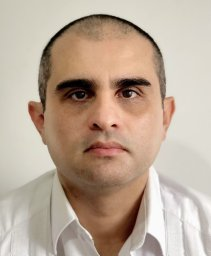



---



---



---



---



---



---



---



---

:::{.section_bulletin}
# THE JEFFREYS PRIOR AT 80: A FOUNDATION FOR OBJECTIVE BAYESIAN INFERENCE {#sec-jeff}
[Javier Rubio](mailto:f.j.rubio@ucl.ac.uk){style="color:white; text-align: center;"} and [Mark F. J. Steel](mailto:m.steel@warwick.ac.uk){style="color:white; text-align: center;"}
:::

::: {.column-margin}
{style="float:center;vertical-align:middle;
margin:10px 20px;border-radius: 10px;max-width: 100%;"}
{style="float:center;vertical-align:middle;
margin:10px 20px;border-radius: 10px;max-width: 100%;"}
:::

<iframe src="contributions/_jeff80.html" width="100%" height="2300" style="border:none; overflow:hidden;"></iframe>

---

:::{.section_bulletin}
# SOFTWARE HIGHLIGHT {#sec-soft}
[Christopher Paciorek](mailto:paciorek@stat.berkeley.edu){style="color:white; text-align: center;"}, [Perry de Valpine](mailto:pdevalpine@berkeley.edu){style="color:white; text-align: center;"}, [Daniel Turek](mailto:danielturek@gmail.com){style="color:white; text-align: center;"}, [Paul van Dam-Bates](mailto:paul.vandambates@gmail.com){style="color:white; text-align: center;"}, [Wei Zhang](mailto:wei.zhang.stats@gmail.com){style="color:white; text-align: center;"}, and [Ken Kellner](mailto:ken@kenkellner.com){style="color:white; text-align: center;"}
:::

::: {.column-margin}
{style="float:center;vertical-align:middle;
margin:10px 20px;border-radius: 10px;max-width: 100%;"}
:::

<iframe src="contributions/_software.html" width="100%" height="10500px" style="border:none; overflow:hidden;"></iframe>

---



